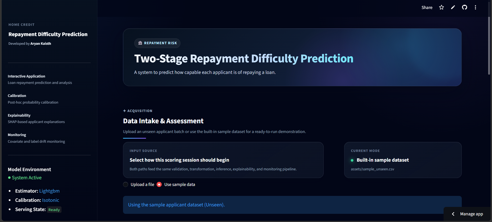
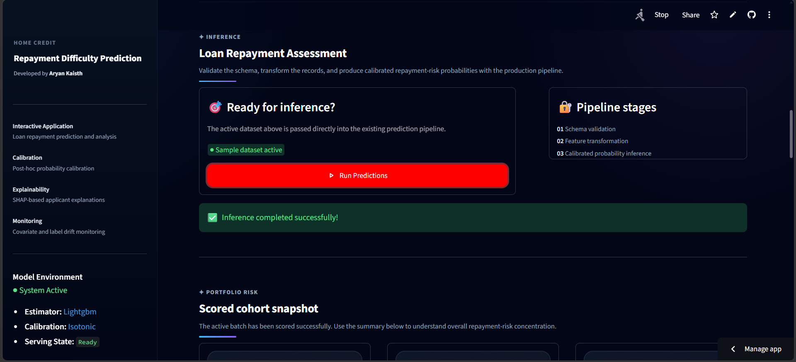
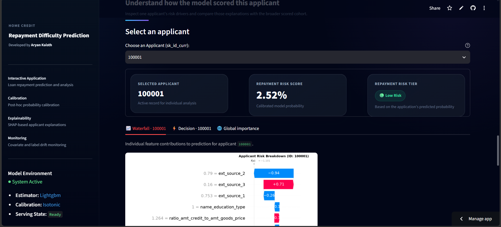
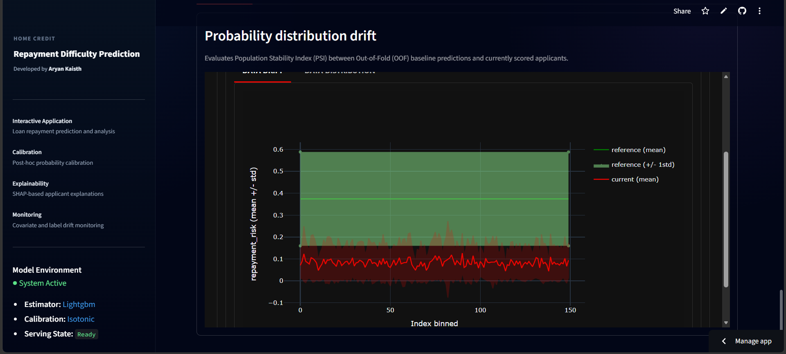
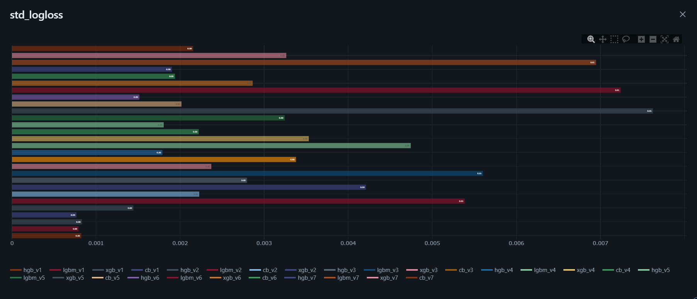
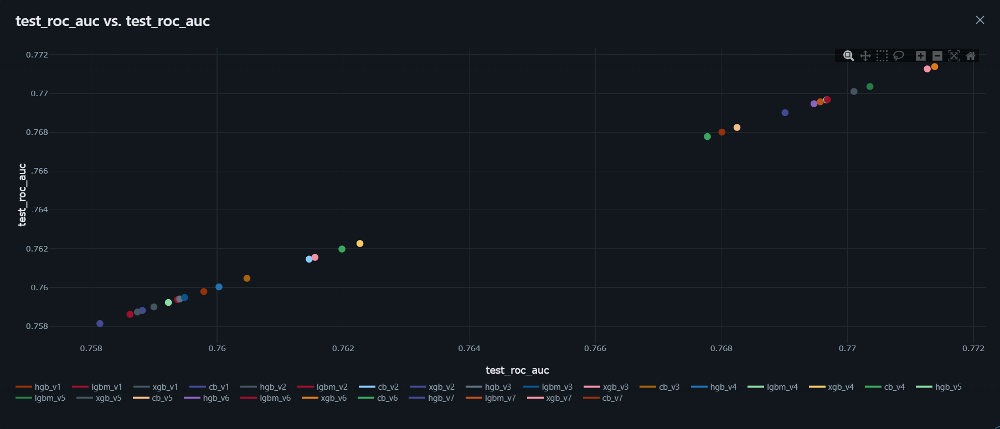

<p align="left">
  
</p>

An Explainable two-stage machine learning system with post-hoc probability calibration for Home Credit repayment difficulty prediction.

[]()
[]()
[]()
[]()
[]()
[]()
[]()
[]()

## Problem Statement

Many people who need loans do not have a traditional credit score. If someone has never held a standard bank credit card or a formal mortgage, traditional financial institutions usually have no record of them. As a result, banks often reject these applicants automatically, assuming no credit history means high risk.

This creates a real problem on both sides:
* **For applicants:** Trustworthy, capable individuals are locked out of basic financial services simply because they lack formal credit records.
* **For lenders:** Banks miss out on reliable customers and struggle to tell the difference between a capable borrower with no history and someone who is genuinely likely to default.

The **Home Credit Default Risk** dataset from Kaggle provides alternative financial and behavioral records such as past loan applications, monthly payment habits, credit card usage, and installment histories to help bridge this gap.

### The Objective

> **"Can you predict how capable each applicant is of repaying a loan?"**

Our goal is to build a model that looks across these alternative behavioral records to identify which applicants are likely to encounter repayment difficulty. Because roughly 92% of applicants repay successfully and only ~8% struggle, the system must be precise enough to flag true repayment friction without unfairly turning away capable borrowers.

## Interactive Application System

I built this end-to-end Streamlit application to bridge the gap between machine learning modeling and practical, transparent credit underwriting. Instead of outputting uncalibrated tree scores, the platform applies post-hoc probability calibration (Sigmoid / Isotonic scaling) so every prediction reflects a genuine, mathematically grounded probability of repayment difficulty.

To make individual lending decisions transparent and auditable, the system allows underwriters to look up any applicant by their `SK_ID_CURR` and inspect exact risk drivers through local SHAP waterfall and decision trajectories, while also providing a global SHAP beeswarm to analyze portfolio-wide risk factors. For ongoing model reliability, the dashboard features embedded real-time monitoring via Evidently AI to track covariate feature shift and prediction drift (PSI) against training baselines.

<p align="left">
  <a href="app/assets/project_display.mp4">
    
  </a>
</p>

### Application Previews

<table>
  <tr>
    <td width="50%" align="center">
      <b>Data Acquisition</b><br><br>
      
    </td>
    <td width="50%" align="center">
      <b>Probability Calibration & Prediction</b><br><br>
      
    </td>
  </tr>
  <tr>
    <td width="50%" align="center">
      <b>Local & Global SHAP Explainability</b><br><br>
      
    </td>
    <td width="50%" align="center">
      <b>Evidently AI Production Monitoring</b><br><br>
      
    </td>
  </tr>
</table>

### Launching the Application

Run the Streamlit application locally with `uv`:

```bash
uv run streamlit run app/streamlit_app.py
```

## Architectural Flow

### Repository Structure

```text
.
├── app/                  # Streamlit triage interface & visualization components
├── configs/              # Centralized runtime configuration & hyperparameter schemes
├── data/                 # Raw/processed data assets & dataset documentation (see data/README.md)
├── docs/                 # Architectural diagrams, ER schematics, and UI assets
├── notebooks/            # Exploratory research, prototyping, and experiment sandboxes
├── reports/              # Databricks EDA & Evidently data drift reports (see reports/README.md)
├── src/
│   ├── components/       # Core pipeline components (Ingestion, Validation, Transformation, Training, Calibration)
│   ├── constants/        # Fixed project paths, schema keys, and environment variables
│   ├── entity/           # Config and Artifact dataclass definitions
│   ├── pipelines/        # Training and inference execution pipelines
│   ├── model_factory.py  # Model registry interface
│   └── plot.py           # Evaluation curve and SHAP visualization generators
├── artifacts/            # Versioned local runs, serialized models, and OOF outputs
├── .gitignore            # Git exclusion rules for large data, artifacts, and local environments
├── pyproject.toml        # Project metadata and core dependencies
├── uv.lock               # Deterministic dependency lockfile
└── README.md
```

## Dataset

This project utilizes the **Home Credit Default Risk** dataset from Kaggle. 

For complete dataset documentation, entity-relationship diagrams, feature dictionaries, and domain knowledge, refer to the [About data](./data/README.md).

## Experiment Tracking

All feature engineering iterations, model architectures, hyperparameter configurations, cross-validation runs, and evaluation metrics are systematically tracked and versioned using **MLflow**, as captured in the dashboard screenshots below.

<p align="left">
  
</p>

<p align="left">
  
</p>

### Monitored Metrics

To evaluate model discrimination and stability under class imbalance (~8% default rate), each run logs out-of-fold cross-validation variance and holdout test set performance:

* **Cross-Validation Stability ($N$-Fold OOF):**
  * `oof_roc_auc` & `oof_logloss`: Aggregate out-of-fold probability performance.
  * `std_roc_auc`: Standard deviation of ROC-AUC scores across all $N$ folds.
  * `std_logloss`: Standard deviation of Log Loss across all $N$ folds.
* **Holdout Test Set (Evaluation Gate):**
  * `test_roc_auc` & `test_logloss`: Generalization metrics evaluated on unseen test data.
  * `precision` & `recall`: Threshold-level operational trade-offs for high-risk triage.

### Launching the MLflow UI

Run the local MLflow server using `uv`:

```bash
uv run mlflow ui --backend-store-uri sqlite:///notebooks/model_training/mlflow.db --port 8000
```

## Analytics, EDA & Drift Reports

Comprehensive exploratory data analysis, visual storytelling, missing value diagnostics, and feature relationship studies were conducted on **Databricks**, with statistical train/test data drift testing tracked via **Evidently AI**.

refer to the [Analytics & Reports Documentation](./reports/README.md).