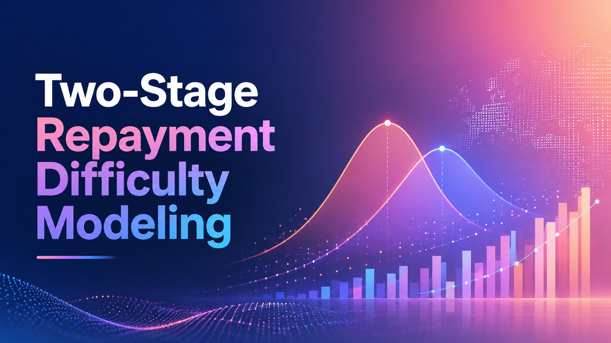

<p align="left">
  
</p>

An Explainable two-stage machine learning system with post-hoc probability calibration for Home Credit repayment difficulty prediction.

[]()
[]()
[]()
[]()
[]()
[]()

## Problem Statement

Many people who need loans do not have a traditional credit score. If someone has never held a standard bank credit card or a formal mortgage, traditional financial institutions usually have no record of them. As a result, banks often reject these applicants automatically, assuming no credit history means high risk.

This creates a real problem on both sides:
* **For applicants:** Trustworthy, capable individuals are locked out of basic financial services simply because they lack formal credit records.
* **For lenders:** Banks miss out on reliable customers and struggle to tell the difference between a capable borrower with no history and someone who is genuinely likely to default.

The **Home Credit Default Risk** dataset from Kaggle provides alternative financial and behavioral records such as past loan applications, monthly payment habits, credit card usage, and installment histories to help bridge this gap.

### The Objective

> **"Can you predict how capable each applicant is of repaying a loan?"**

Our goal is to build a model that looks across these alternative behavioral records to identify which applicants are likely to encounter repayment difficulty. Because roughly 92% of applicants repay successfully and only ~8% struggle, the system must be precise enough to flag true repayment friction without unfairly turning away capable borrowers.

## Architectural Flow

### Repository Structure

```text
.
├── app/                  # Streamlit triage interface & visualization components
├── configs/              # Centralized runtime configuration & hyperparameter schemes
├── data/                 # Raw/processed data assets & dataset documentation (see data/README.md)
├── docs/                 # Architectural diagrams, ER schematics, and UI assets
├── notebooks/            # Exploratory research, prototyping, and experiment sandboxes
├── reports/              # Databricks EDA & Evidently data drift reports (see reports/README.md)
├── src/
│   ├── components/       # Core pipeline components (Ingestion, Validation, Transformation, Training, Calibration)
│   ├── constants/        # Fixed project paths, schema keys, and environment variables
│   ├── entity/           # Config and Artifact dataclass definitions
│   ├── pipelines/        # Training and inference execution pipelines
│   ├── model_factory.py  # Model registry interface
│   └── plot.py           # Evaluation curve and SHAP visualization generators
├── artifacts/            # Versioned local runs, serialized models, and OOF outputs
├── .gitignore            # Git exclusion rules for large data, artifacts, and local environments
├── pyproject.toml        # Project metadata and core dependencies
├── uv.lock               # Deterministic dependency lockfile
└── README.md
```

## Dataset

This project utilizes the **Home Credit Default Risk** dataset from Kaggle. 

For complete dataset documentation, entity-relationship diagrams, feature dictionaries, and domain knowledge, refer to the [About data](./data/README.md).

## Analytics, EDA & Drift Reports

Comprehensive exploratory data analysis, visual storytelling, missing value diagnostics, and feature relationship studies were conducted on **Databricks**, with statistical train/test data drift testing tracked via **Evidently AI**.

refer to the [Analytics & Reports Documentation](./reports/README.md).