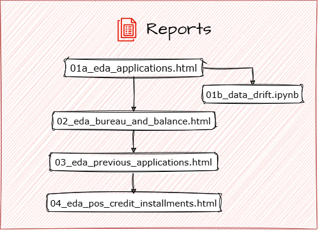
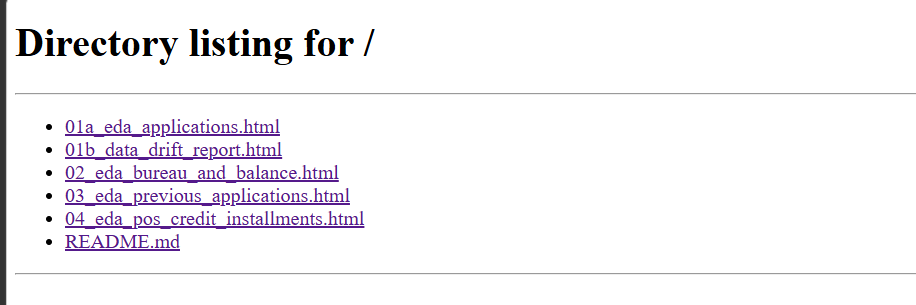

# EDA Reports

<p align="left">
  
</p>

The `reports/` directory contains the **HTML reports exported directly from Databricks notebooks** after completing the exploratory data analysis of the Home Credit dataset.

The reports are organized around different stages of an applicant's credit journey — starting with the **current application**, moving through **external and previous credit history**, and finally looking at **detailed repayment behavior**.

> **About Dataset:**
> For more information about the tables, their relationships, and data structure, see the [dataset documentation](../data/README.md).

---

## Reports

### 01 · Applications

[`01_eda_applications.html`](./01_eda_applications.html)

The analysis starts with the **current loan applications**, giving us the baseline view of each applicant and the loan being evaluated.

The report examines the applicant's **financial, demographic, employment, family, housing, and credit-related characteristics** available at the time of application. It also looks at the **target distribution, data quality, variable distributions, and relationships between applicant characteristics and repayment outcomes**, establishing the foundation for the analyses that follow.

**Related report:**  
[`01b_data_drift.html`](./01b_data_drift.html) — Examines **data drift and distributional differences** between the relevant datasets. Drift is evaluated against predefined thresholds, with automated tests configured to **fail when the detected drift exceeds the acceptable threshold**, providing an additional data-quality check alongside the main application EDA.

---

### 02 · Bureau & Bureau Balance

[`02_eda_bureau_and_balance.html`](./02_eda_bureau_and_balance.html)

We then step back and examine the applicant's **external credit history**.

The `bureau` table contains previous credits reported by other financial institutions, while `bureau_balance` provides the **monthly history of those credits**. The report explores the scale and nature of applicants' previous credit obligations, their **credit status and balance patterns over time**, and how this historical information contributes to a broader picture of an applicant's credit profile.

---

### 03 · Previous Applications

[`03_eda_previous_applications.html`](./03_eda_previous_applications.html)

Next, the analysis moves to the applicant's **previous interactions with Home Credit**.

The `previous_application` table records earlier loan applications made by applicants in the current sample. This report looks at their **previous application outcomes, loan characteristics, requested and approved amounts, and other attributes of past borrowing**, helping connect an applicant's current application with their history of interactions with Home Credit.

---

### 04 · POS, Credit Card & Installments

[`04_eda_pos_credit_installments.html`](./04_eda_pos_credit_installments.html)

Finally, we move from application and credit history into **actual account and repayment behavior**.

This report brings together monthly histories from previous **POS/Cash loans and credit cards** with detailed **installment payment records**. It explores how balances and account status changed over time, along with **payment amounts, missed or delayed payments, and repayment patterns**, providing the most detailed view of an applicant's previous credit behavior in the dataset.

---

## How to View the Reports

The reports are standalone HTML files and can be opened directly in any modern web browser.

```bash
cd reports
python -m http.server 8000
```

Then open `http://localhost:8000` in your browser and select the report you want to explore.

<p align="left">
  
</p>